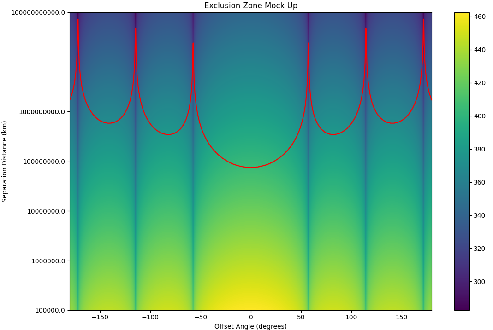

# Sat-Prop-RAO: Satellite to ground RF propagation analysis for Radio Astronomy Observatories
<div align="center">

<!-- Badges -->
## [📘 Documentation](https://tbd/)
<!-- (Badges) -->
</div>

**Sat-Prop-RAO** is a python package that estimates interference from satellite RF emissions to radio astronomy observatories. It is derived from the ITU recommendations: [ITU-R RA.769-2](https://www.itu.int/dms_pubrec/itu-r/rec/ra/R-REC-RA.769-2-200305-I!!PDF-E.pdf) and supports multiple pathloss models.

**Core features:**
- Point-to-point power flux density (PFD) dB(W/m^2) estimation
- Exclusion zone estimation

## Installation
#### latest version
```pip install git+https://github.com/DGalanosNTIA/Sat-Prop```

## Usage

#### sat-prop-ptp
Point-to-point satellite to ground receiver power flux density dB(W/m^2) estimation.
Directly enter parameters:


#### sat-prop-exclusion
Work in progress, sample:




## Theory

#### Coordinate System

The primary coordinate system for all underlying computation is the Earth-centered Earth-fixed (ECEF) coordinate system (meters). Users may enter parameters in ECEF using the flag --ecef. However, by default, positions are entered as latitude (degrees), longitude (degrees), elevation (meters) and array-normal vectors are entered using the locally valid ENU (east, north, up) coordinate system.


**λ** is longitude (0 degrees is referenced to the Prime Meridian)
**φ** is latitude (0 degrees is referenced to the equator)

#### EIRP and Antenna Patterns
Effective isotropic radiated power is used as an input to disambiguate various definitions of transmit power within the context of complex arrays. 


See: [Effective Radiated Power / Equivalent Isotropic Radiated Power](https://en.wikipedia.org/wiki/Effective_radiated_power) for more details.

This decision has a direct consequence on how antenna patterns are used by the model. Specifically, antenna patterns are normalized to have 0 dBi gain at their pointing direction. 

#### Antenna Patterns

Antenna patterns are represented as a 2-D azimuth (az), elevation (el) surface where values are set in units of dBi. 


Positive azimuth values correspond to east, and positive elevation corresponds to north in the ENU coordinate system.

Antenna patterns may be created as a function following the guidelines in sat_prop/antenna_pattern.py or input as a json file which will then be interpolated in the model.

